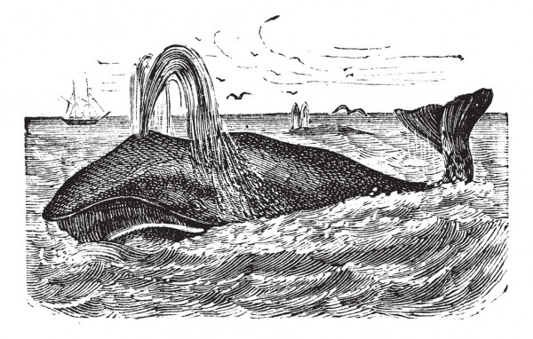

# How is this website built?

This site is built with [Hugo](https://gohugo.io/), which is a static website
generator. It takes a number of content files, mostly written in
[Markdown format](https://www.markdownguide.org/) and a number of HTML
templating files together with some CSS and other static resouces and, given a
configuration file, generates a complete static website. That is to say static
in the sense that it has no server backend generating webpages on the fly.
However you can use JavaScript with Hugo, to make a website interactive in
the browser. I try to use as little JavaScript as possible, because it hurts.

For styling I used the neat CSS framwork [Bulma](https://bulma.io/) which I
primarily wanted to use for its grid system and responsive design capabilities,
and because it is relatively small and seemed cool.

The design of my website was very much inspired by the layout of Greg Restall's
website [consequently.org](https://consequently.org/), but I had actually already
fallen in love with the
[Alegreya](https://typographica.org/typeface-reviews/alegreya-ht/) typeface
before I saw Greg's website! I use the [Ubuntu](https://design.ubuntu.com/font/)
typeface for top menu and bottom footer of the website. Both fonts are available
as Google fonts. If you think the color choices and matchings of the website are
wierd, its probably because I'm partially color blind. But I like them.

All source code for the website is managed in [git](https://git-scm.com/) and I
push it to this [github project](https://github.com/pacoispaco/paulcohen.se).

The generated website is then hosted on a
[Ubuntu 20.04 server](https://ubuntu.com/server) at
[DigitalOcean](https://www.digitalocean.com/) in their Amsterdam location. I
serve the website with the [nginx](https://www.nginx.com/) web server and I
handle my HTTPS server certificates with [Let's encrypt](https://letsencrypt.org/).

I have automated the publishing of the website with
[github actions](https://github.com/features/actions) and set up my deployment
pipline so that everytime I push to the master branch of the
[github project](https://github.com/pacoispaco/paulcohen.se) for the website,
Hugo automatically regenerates the entire website and if that goes well, then
it is automatically deployed with [scp](https://www.ssh.com/ssh/scp/) to my
Digital Ocean Ubuntu server.

# Why did I create this website?

Call me Paul. Some years ago—never mind how long precisely—having little or no prescence on the web or on Internet, and nothing particular to show on a personal home page, I thought I would set about a little and see the blogging and home paging part of the web. It is a way I have of driving off the spleen and regulating the circulation. Whenever I find myself growing grim about the mouth; whenever it is a damp, drizzly November in my soul; whenever I find myself involuntarily pausing before coffin warehouses, and bringing up the rear of every funeral I meet; and especially whenever my hypos get such an upper hand of me, that it requires a strong moral principle to prevent me from deliberately stepping into the street, and methodically knocking people’s hats off—then, I account it high time to get to surfing the web as soon as I can. This is my substitute for pistol and ball. With a philosophical flourish Cato throws himself upon his sword; I quietly take to the web. There is nothing surprising in this. If they but knew it, almost all people in their degree, some time or other, cherish very nearly the same feelings towards blogging and home pages as I do.

Ok. Enough of that Melvillian paraphrasing. This website exists because:

* I wanted to experiment with Hugo, the static web page tool used to build this
  website, and with Bulma, the CSS framework used to style this website.
* I have a few ideas and opinions on software, the web and other assorted digital and
  technical stuff that may be of interest to others.
* I have a few spare time interests I want to document for my own sake, and
  which also may be of interest to others.
* It's fun to write down sentences of words and see if they make sense.

I've tried a few times before to have a web site and do a blog. Let's see how this try turns out.

Some of my interests that may be expressed in blog posts or articles on this
site are:

 * Software development. As an engineering discipline, as a creative craft and
   as a fascinating social team experience.
 * Software development processes and how software is eating the world.
 * The importance of freedom and openess for innovation, prosperity and a good
   life for everyone.
 * Birds. And photographing and recording them. And drawing them.
 * Baysian statistics and its applications in AI and machine learning as well
   as NLP (Natural Language Processing) and its applications in AI and machine learning.
 * Gaming historical conflicts in the form of physical board games.
 * Human ingenuity, kindness, compassion, stupidity and cruelty throughout history.

In the real world, I have a family with two wonderful kids, have a job and do my bit of socializing. But I don't write about that here.

# Some legalese to cover my ass

If you believe any texts, images, sounds, movies or any other sequence of bits and bytes on this site encroach on your intellectual "property" rights in any way, please tell me and provide evidence of your claim. I may then humbly beg your pardon, and permantly move any such virtual property to /dev/null, and after that retire back over that invisible digital property fence that I have crossed, but did not see.

